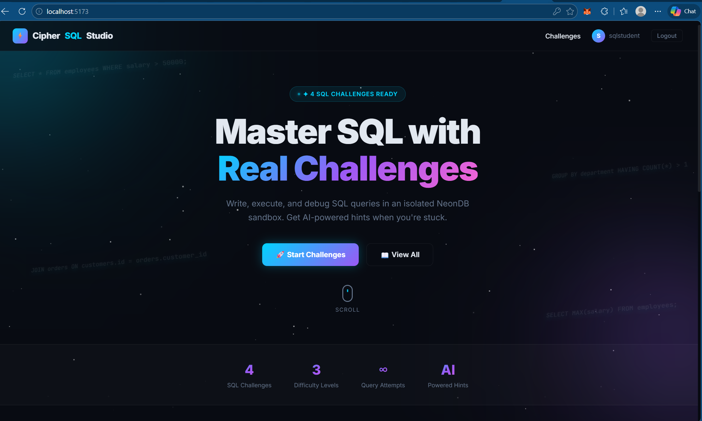
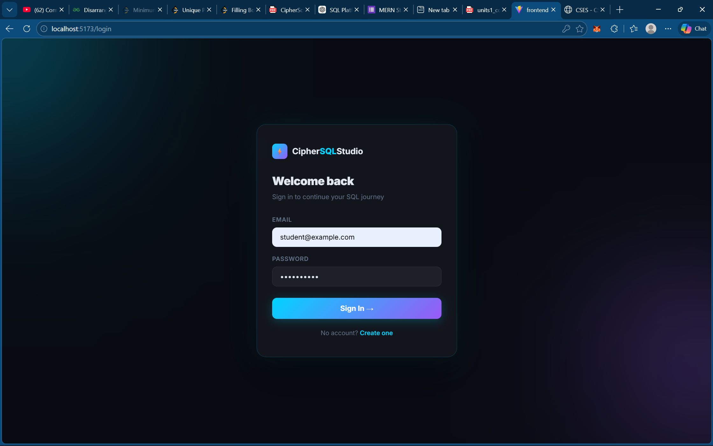
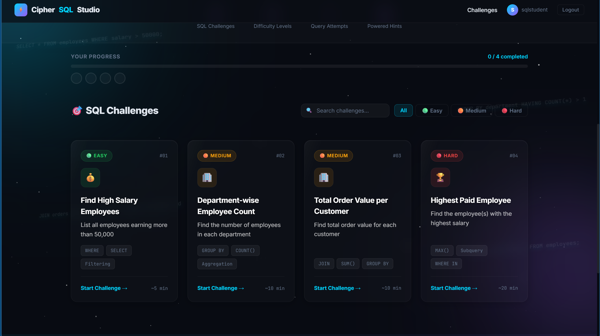
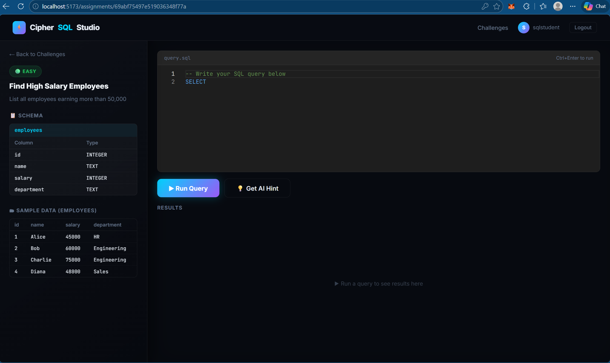

# CipherSQLStudio


*(Home Page)*


*(Login Page)*

 CipherSQLStudio is an interactive, browser-based SQL challenge platform. It allows users to write, execute, and evaluate authentic PostgreSQL queries against isolated, transaction-backed data sandboxes safely from their browser, while also providing AI-curated hints when users get stuck.

It is specifically designed with a premium 3D-aesthetic frontend utilizing advanced glassmorphism and deep Z-axis CSS styling to provide a highly immersive user experience.

---

## 🎨 UI / UX & 3D Aesthetics

The platform is designed to look like a premium, modern developer tool. We abandoned flat styling in favor of deep volumetric CSS properties:

- **Glassmorphism:** The layout utilizes complex `backdrop-filter: blur()` properties mixed with directional `box-shadow` inset/outset gradients to make panels look like they are carved from solid glass.
- **Dynamic 3D Tilts:** Challenge cards compute your mouse X/Y coordinates in real-time. This translates into native CSS `transform: rotateX() rotateY()` equations that tilt the card naturally toward your cursor.
- **Deep Z-Axis Translation:** While the cards tilt, the internal elements (icons, text, badges) are pushed forward using `translateZ(30px)`, creating a physical parallax gap where the text literally floats off the card background.
- **Volumetric Lighting & Glare:** A custom radial-gradient layer tracks your mouse over the cards, simulating a glossy glass reflection shining under a moving light. Background orbs utilize stacked offset shadows to appear as glowing 3D spheres rather than flat colored circles.


*(Challenges Dashboard)*


*(SQL Editor Execution Screen)*

---

## 🌟 Key Features
- **Isolated SQL Sandboxes:** Users execute real SQL queries within dynamically provisioned PostgreSQL schemas that immediately rollback after execution, keeping the primary database forever pristine.
- **AI-Powered Hints:** Integrated with Gemini AI to analyze the user's specific SQL query and schema structure to provide non-giveaway, educational hints.
- **Premium 3D Aesthetics:** Volumetric spherical backgrounds, dynamic mouse-tracking glare reflections, deep box-shadow glassmorphism, and responsive 3D card tilts built purely with native CSS.
- **Real-time Query Validation:** Pure backend comparison between the user's query results and the stored Expected Output matrix.
- **Progress Tracking:** Saves attempt history and query results securely to MongoDB.

---

## 🛡️ Security Implementation (Validation & Sanitization)

Because CipherSQLStudio executes arbitrary SQL provided by users, we implemented a dual-layer security model to prevent SQL Injection (SQLi) and malicious database modification:

1.  **Regex Pre-Validation Filter (Application Layer):** 
    Before any query reaches the database driver, the Express backend passes the raw SQL through an `isSafeQuery` regex filter. This aggressively blocks execution of destructive commands (like `DROP`, `DELETE`, `UPDATE`, `INSERT`, `ALTER`, `TRUNCATE`, `GRANT`, `COPY`) before they leave the Node server. We strictly lock the platform down to `SELECT` and `WITH` (CTE) statements.
    
2.  **Transactional Rollbacks (Database Layer):** 
    As a fail-safe, the entire execution flow—from creating temporary schemas to loading sample data and executing the user query—is wrapped in a strict PostgreSQL `BEGIN ... ROLLBACK` transaction block. Even if a user somehow circumnavigated the regex filter and dropped a table, the transaction is forcefully reversed at the end of the API call, ensuring zero permanent changes are committed to NeonDB.

---

## 🏗️ Technology Stack

We constructed a highly secure, real-time code-execution platform by separating our application state (NoSQL) from our execution environments (SQL).

| Technology | Role inside CipherSQLStudio | Why we chose it for this project |
| :--- | :--- | :--- |
| **React (Vite)** | Frontend UI | Provides a lightning-fast development environment with instant HMR, which was crucial for developing our complex CSS 3D effects and real-time editor state. |
| **Express (Node.js)** | Backend Server | Offers highly efficient asynchronous I/O. Its non-blocking architecture is ideal for securely proxying data, implementing query validation/sanitization, and managing concurrent requests to MongoDB, NeonDB, and Gemini. |
| **MongoDB** | State & Metadata | Schemaless document storage perfectly handles assignments holding wildly variable configurations. Storing dynamic JSON configurations like `sampleTables` and `expectedOutput` graphs is deeply native to MongoDB's BSON structure. |
| **NeonDB (PostgreSQL)** | Query Execution Engine | Provides crucial Serverless Postgres capabilities. Because PostgreSQL supports **Transactional DDL**, we can safely provision temporary data, execute the user's potentially destructive SQL queries inside a sandbox, and perform an instant `ROLLBACK` to guarantee a permanently clean database. |
| **SCSS (Sass)** | Styling Architecture | CSS preprocessors allow for complex logic using mixins, variables, and nested rules, which gave us the granular control necessary to manually orchestrate deep 3D keyframe animations and multi-layered glassmorphic shadow variables. |

---

## 🚀 Local Setup Instructions

### Prerequisites
- Node.js (v18+)
- MongoDB Atlas Account
- NeonDB Account (PostgreSQL)

### 1. Clone the repository
```bash
git clone https://github.com/yourusername/ciphersqlstudio.git
cd CipherSQLStudio
```

### 2. Environment Variables (.env)
Create a `.env` file in the `backend` directory. You will need the following secret keys:
```env
# MongoDB Connection String
MONGODB_URI=mongodb+srv://<user>:<pwd>@cluster...

# NeonDB Transaction pooler string 
DATABASE_URL=postgresql://<user>:<pwd>@ep-...neon.tech/neondb?sslmode=require

# Google Gemini API key for Hints
GEMINI_API_KEY=AI...

# Auth Secret signature
JWT_SECRET=your_super_secret_key_here

# API Port
PORT=5000
```

### 3. Install Dependencies
You need to install packages for both the backend and frontend.
```bash
# Install Backend
cd backend
npm install

# Install Frontend
cd ../frontend
npm install
```

### 4. Database Seeding
To populate MongoDB with the initial assignment data (the questions, sample tables, and expected output schemas), run the seeder script:
```bash
cd backend
npm run seed
```

### 5. Running the Application
Launch both development servers concurrently.
```bash
# Terminal 1:
cd backend
npm run dev
# Running on http://localhost:5000

# Terminal 2:
cd frontend
npm run dev
# Running on http://localhost:5173
```
